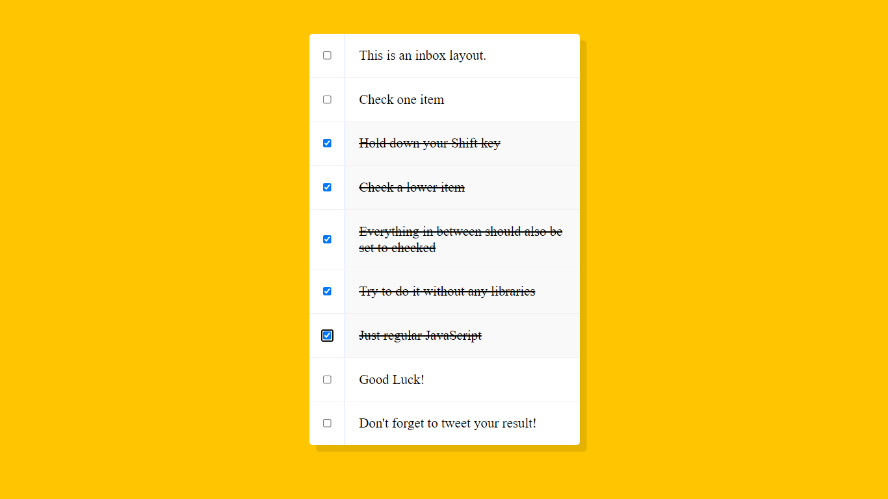

## JavaScript-30 Day-10

<h1 align="center"> Hold Shift And Check Checkboxes </h1>

> Learned how to select the elements by the type key.

##

### ✨ [Demo]()
##



## Features & Usage

```sh
- you can select many points by holding shift key
```
